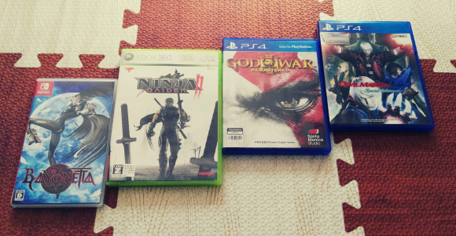
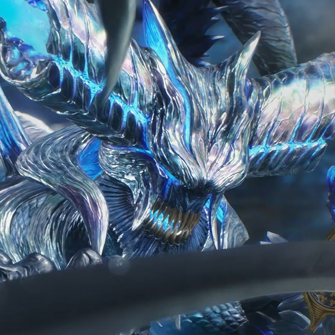

# 传统ACT的没落是必然

四大ACT的大名相信大家都听说过。鬼泣、猎天使魔女、战神、忍龙。忍龙还没玩，战神已经转行ARPG了（虽然还是挺精彩）。鬼泣、猎天使魔女我都玩了。虽然对于我来说没啥讨厌的游戏，但猎天使魔女是真的难。

**但我真的很想让传统ACT活下去**

鬼泣的设定真是又帅又中二。看这魔人化，看这真魔人
。而且动作的操作性真的很成熟自然。玩家可以自由的使用自己想用的招式，但要自己承受后果。这么大的自由度也就有大佬愿意花时间去打段子。

贝优妮塔的人设也是十分出色（虽然我没感觉），但我觉得它的游戏设计，动作设计，难度都无愧于四大ACT这一名号。还有，魔女的特色是offset不是魔女时间。

接下来就是缺点了，鬼泣3才确定了鬼泣ACT的身份，之后是一部比一部经费少。中间的DMC确实很不错，但也受到了老玩家的抵触（虽然我不知道他们抵触个啥，这一作的许多创新点有很多都没借鉴了）。这真的是一个伏笔。新手看着大佬们打的段子，想学，结果发现一个十几秒的段子可能要练几个小时，有这时间还不如玩别的游戏呢。这无可厚非，好游戏太多了，但这样传统ACT就很难活了。新手吸引不了，核心玩家又撑不起来，ACT的没落则是必然。

虽然鬼泣5发售有很多设计问题，战神已经转行，魔女3不知道会不会出，忍龙更是不知道还活不活了。但我觉得哪怕是重置也好，未来会有传统ACT大作。

